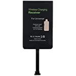
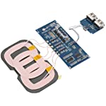
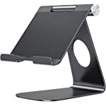
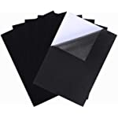
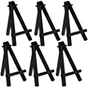
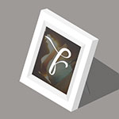

# Handheld Digital Photo Frame
There are a lot of really great open source and DIY solutions for wall-mounted digital photo frames, most running [MagicMirror²](https://github.com/MichMich/MagicMirror) on Raspbery Pis. However, we wanted something that allows the user to hold the display and swipe through the photos, in addition to a default, passive slideshow mode. For convenience, it would also need to charge wirelessly. Our solution cost $143 and is made from off-the-shelf hardware and software.

| Feature | Solution |
| --- | --- |
| Cheap, handheld touch screen | Amazon Fire HD 8 (2018, 8th Generation) [unlocked and rooted](https://forum.xda-developers.com/t/fire-hd-8-2018-only-unbrick-downgrade-unlock-root.3894256/), running [LineageOS](https://lineageos.org/) |
| Digital photo frame software with passive and interactive modes | [Fotoo](https://play.google.com/store/apps/details?id=com.bo.fotoo&hl=en_US&gl=US) via [Open GApps](https://opengapps.org/)|
| Photos updated via GMail and Google Drive | [Gmail2GDrive](https://github.com/ahochsteger/gmail2gdrive) |
| Wireless charging | DIY wireless charging stand |

## Materials / Costs
 |  |  |  |  |  |  |  |
| --- | --- | --- | --- | --- | --- | --- | --- |
| [Amazon Fire HD 8 Tablet (2018, 8th Generation)](https://www.amazon.com/gp/product/B0794RHPZD)* ($57) | [Micro-USB Qi Charger Receiver](https://www.amazon.com/gp/product/B07C82R5DD) ($11) | [3-Coil Qi Wireless Charger Transmitter](https://www.amazon.com/gp/product/B07M6CRGFP) ($18) | [Tablet Stand](https://www.amazon.com/dp/B06XKCSJDB) ($16) | [E6000 Adhesive (Black)](https://www.amazon.com/Eclectic-Products-Multipurpose-Adhesive-2-Ounce/dp/B07DS6BZR8) ($9) | [Adhesive Felt (Black)](https://www.amazon.com/gp/product/B08CZFQB7M) ($7) | [Square Dowels (Black)](https://www.amazon.com/dp/B00NLOYFTE) ($10) | [Fotoo - Digital Photo Frame Photo Slideshow Player](https://play.google.com/store/apps/details?id=com.bo.fotoo&hl=en_US&gl=US) ($15) |

*IMPORTANT: Must be 8th Generation (2018) model. Either 16GB or 32GB is okay.

## Set Up the Backend
1. Sign up for a new, dedicated [Google Account](https://accounts.google.com). Something like `xxxx.family.photo.frame@gmail.com` is probably available. (Google enables a bunch of tracking and advertising by default. Find Privacy Settings to turn these off.)
2. Create a folder in [Google Drive](https://drive.google.com) named "Digital Photo Frame"
3. Follow the Setup instructions for [Gmail2GDrive](https://github.com/ahochsteger/gmail2gdrive) with the following modifications/details:
   1. On Step 5, use [this Config.gs](Config.gs). By default, this configuration downloads photos sent from any email address. If you wish to restrict this to specific email addresses, replace line 25 with a version of line 23 or 24. (This is more secure, but probably not a real threat.)
   2. Before Step 7, email a photo to your new `xxxx.family.photo.frame@gmail.com` address. To manually run Gmail2Gdrive(), click Code.gs and then ▷ Run. Grant all permissions requested. If everything works, your photo will now be in Google Drive in your Digital Photo Frame folder.
   3. For Step 8, click ⏰ Triggers, then + Add Trigger. Use these options:
      * Gmail2GDrive (Choose which function to run)
      * Head (Choose which deployment should run)
      * Time-driven (Select event source)
      * Minutes timer (Select type of time based trigger)
      * Every 10 minutes (Select minute interval)

## Unlock the Tablet
1. Turn off and fully charge the tablet.
2. Take the back plastic off the tablet. < PHOTO >
3. Follow [these instructions](https://forum.xda-developers.com/t/fire-hd-8-2018-only-unbrick-downgrade-unlock-root.3894256/) by xyz\` to root the tablet, with the following modifications:
   1. After Step 10, you may get this error: `fastboot: error unknown target "recovery"` [The solution](https://forum.xda-developers.com/t/fire-hd-8-2018-only-unbrick-downgrade-unlock-root.3894256/post-85721447) is to run this command: `fastboot reboot emergency`
   2. At Step 12, you'll also want to download two more files: [LineageOS 18.1](https://forum.xda-developers.com/t/rom-unstable-unlocked-karnak-lineage-18-1-25-october-2021.4352241/) unofficial build by Kaijones23 and [Open GApps](https://opengapps.org/) ARM 11.0 Pico. Push them like the other files: `adb push [filename].zip /sdcard`
   3. After Step 20, reboot into recovery again. (Hold down the power button, select "Restart", then hold the volume down button as the tablet restarts.)
   4. Select "Wipe", then "Advanced Wipe", and select System, Data, and Cache. Swipe to wipe.
   5. Select "Install", then select the Lineage OS ZIP file. Swipe to wipe.
   6. Go back and do the same to install the Open GApps ZIP file. Swipe to wipe.
   7. Select "Reboot System".
   8. Done! Reassemble the tablet.

## Set Up Tablet Apps
1. Log in to your WiFi network
2. Set up Google Apps with your new `xxxx.family.photo.frame@gmail.com` account
3. Launch the Google Play Store and install:
   * [Fotoo](https://play.google.com/store/apps/details?id=com.bo.fotoo&hl=en_US&gl=US) ($0 demo, $15 in-app purchase for full features)
   * [Google Drive](https://play.google.com/store/apps/details?id=com.google.android.apps.docs&hl=en_US&gl=US) (Optional. Allows you to organize photos directly from the device.)
4. Launch Fotoo
   1. Select Google Drive and link your `xxxx.family.photo.frame@gmail.com` account. Select My Files and check the box next to Digital Photo Frame. Select Complete.
   2. Turn on Launch On Boot, and enable "draw system overlay" permission for Fotoo when requested
   3. My preferred settings:
      * Display Effect: Scale to Fit Center
      * Transition Effect: Cross Fade
      * Order: Random (preference given to recent photos)

## Kioskify the Tablet
1. Go to Settings > Apps & Notifications > See All 19 Apps. Select each of the following apps and press Disable. (You may have to select Force Stop first.)
   * Android Auto
   * Browser
   * Calculator
   * Calendar
   * Clock
   * Contacts
   * Music
   * Recorder
2. In Settings > Display
   * Select Brightness Level and increase it to 100%
   * Select Adaptive Brightness and turn Adaptive Brightness off
   * Under Advanced > Rotation settings, turn on Auto-Rotate Screen
   * Select Advanced > Screen Saver > When to Start, and select Never
   * Under Advanced > Lock Screen > Notifications on Lock Screen, select Don't Show Notifications At All
   * Under Advanced > turn Tap to Sleep off
3. In Settings > About Tablet
   * Tap Build Number 7 times to unlock Developer Mode
4. In Settings > System > Status Bar
   * Select System Icons and turn off everything but WiFi and Battery
   * Turn off Auto Brightness
5. In Settings > System > Developer Options
   * Turn on "Stay Awake"
   * Turn off "Automatic System Updates"
6. Remove all apps except Fotoo and Google Drive from the Home Screen by dragging them to the top of the screen. Move Fotoo and Google Drive to the dock (or your preferred location).
7. Long press on an empty part of the Home Screen. A menu will pop up. Select Home Settings.
   * Turn off Allow Edit
   * Select Hidden & Protected Apps and hide everything. (You can still access Fotoo and Google Drive from the dock.)
   * Turn off Show Icon Labels on Desktop

## Install Wireless Charging

## Final Touches
* You can lock Fotoo

\*project by Jason Eppink and Jenna Eppink
