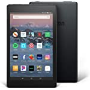

# Another Digital Photo Frame
There are a lot of really great open-source and DIY solutions for wall-mounted digital photo frames, most running [MagicMirror²](https://github.com/MichMich/MagicMirror) on Raspbery Pis. However, we wanted something that allows the user to hold the display and swipe through the photos, in addition to a standard passive slideshow mode. We were able to make one using off-the-shelf hardware and software for a total of $153.

| Feature | Solution |
| --- | --- |
| Cheap touch screen | [Rooted](https://forum.xda-developers.com/t/fire-hd-8-2018-only-unbrick-downgrade-unlock-root.3894256/) Amazon Fire HD 8 running [LineageOS](https://lineageos.org/) |
| Digital photo frame software with passive and interactive modes | [Fotoo](https://play.google.com/store/apps/details?id=com.bo.fotoo&hl=en_US&gl=US) |
| Photos updated via email or cloud storage | [gmail2gdrive](https://github.com/ahochsteger/gmail2gdrive) |
| Wireless charging | DIY wireless charging stand |

## Materials / Costs
 |  |  |  |  |  |  |  |
| --- | --- | --- | --- | --- | --- | --- | --- |
| [Amazon Fire HD 8 Tablet (2018, 8th Generation)](https://www.amazon.com/gp/product/B0794RHPZD) ($57) | [Micro-USB Qi Charger Receiver](https://www.amazon.com/gp/product/B07C82R5DD) ($11) | [3-Coil Qi Wireless Charger Transmitter](https://www.amazon.com/gp/product/B07M6CRGFP) ($18) | [Tablet Stand](https://www.amazon.com/dp/B06XKCSJDB) ($16) | [E6000 Adhesive (Black)](https://www.amazon.com/Eclectic-Products-Multipurpose-Adhesive-2-Ounce/dp/B07DS6BZR8) ($9) | [Adhesive Felt (Black)](https://www.amazon.com/gp/product/B08CZFQB7M) ($7) | [Square Dowels (Black)](https://www.amazon.com/dp/B00NLOYFTE) ($10) | [Fotoo - Digital Photo Frame Photo Slideshow Player](https://play.google.com/store/apps/details?id=com.bo.fotoo&hl=en_US&gl=US) ($25) |

## Unlock the Tablet
1. Charge the tablet
2. something else

## Install ??

## Simplify Settings

## Set Up Software
1. Install Google Play
2. Download Google Drive
3. Download Fotoo. (The demo version is free. The full featured version is $?.)

## Set Up Script

## Set Up Email Address and Script

## Install Wireless Charging

## Final Touches

\*project by Jason Eppink and Jenna Eppink
